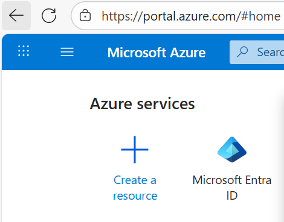
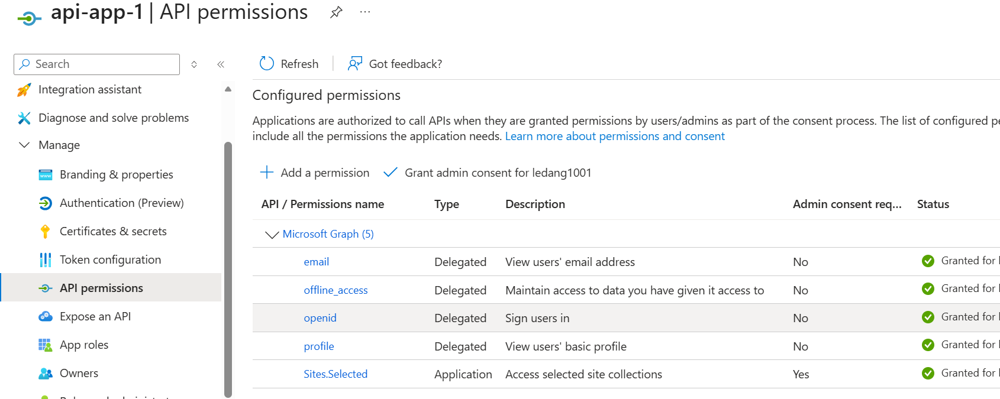
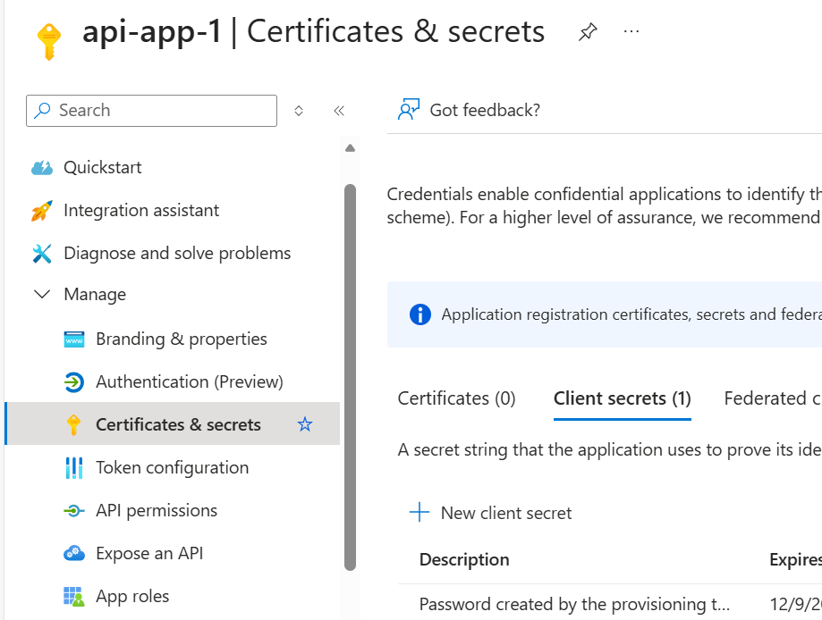
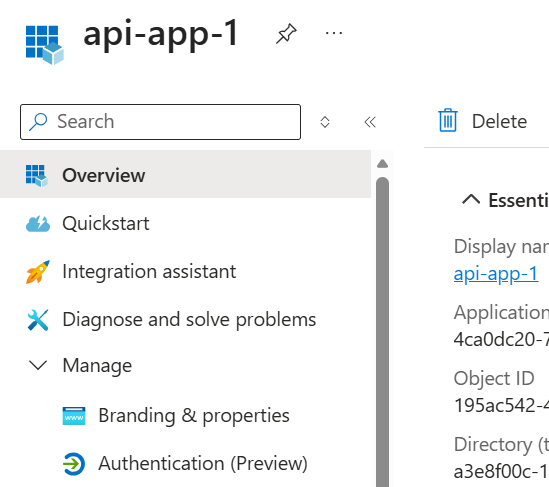

# To test the script, follow these steps:
#1: go to https://portal.azure.com/, click Entra Id

#1 Register app id on Entra Id and set below permissions

#2 Go to Certificates & secrets to Generate secret value and save the value for later use

#3 View the settings to update the settings in .env file or bat file 
